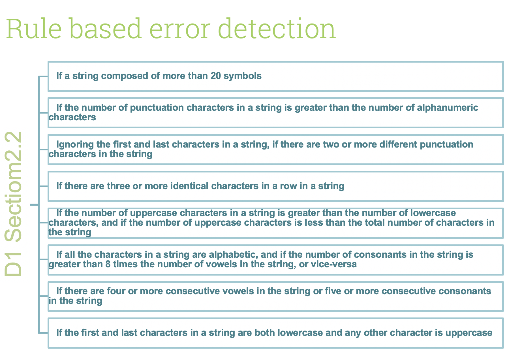
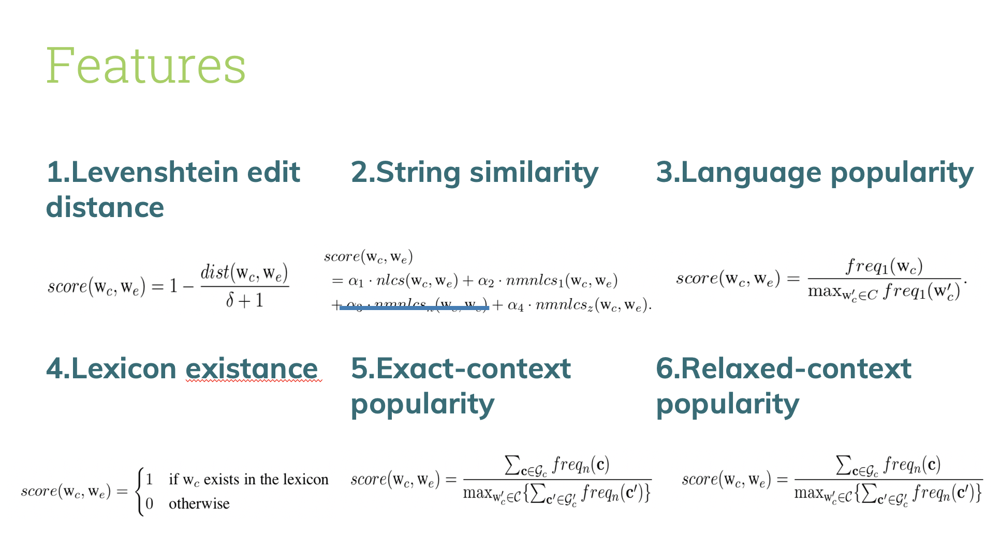

# Project: OCR (Optical Character Recognition) 


### [Full Project Description](doc/project4_desc.md)

+Term: Fall 2018

 + Team #8
 + Team members
	+ Bai, Ruoxi   rb3313
	+ Loewenstein, Oded orl2108
	+ Yan, Jiaming   jy2882
	+ Zhong, Qingyang   qz2317  (presenter)
	+ Zhu, Siyu   sz2716

+ Paper: D1 + C2

**Project summary**: 

+ In this project, we created an OCR post-processing procedure to enhance Tesseract OCR output. 
  
  And here is our steps:
  
 + 1. Preprocess the data, manually trimmed ground truth since there are 13 pairs of Tesseract and ground truth files that do not have the same number of lines. 
 
 + 2. Error Detection, use rule based method from [paper D1](doc/paper/D-1.pdf).


 + 3. Error Correction, first calculate 6 features scoring for each candidate based on assigned [paper C2](doc/paper/C-2.pdf), then use AdaBoost.R2 model on top of decision trees with 0-1 loss function. Generate a prediction of top 3 best results as correction.

 + 4. Evaluate detection preformance by calculating precision and recall for word-level. Then construct a confusion matrix.


 + 5. Evaluated correction performance by calculating precision and recall for both word-level and character-level. Then calculate Top 3 candidate coverage.

 + 6. Evaluate the algorithm as a whole.

	
**Contribution statement**: 

All team members contributed equally in all stages of this project. All team members approve our work presented in this GitHub repository including this contributions statement.

+ Bai, Ruoxi: Designed and organized the structure of the whole project; Data preprocessing(Part 1&2); Error Detection; Regression Model; Evaluation(Detection & Correction) and visualization; Debugging; Code readibility.
+ Loewenstein, Oded: Feature: Levenshtein edit distance & feature: Lexicon existance; Tune parameters from regression model and visualization.
+ Yan, Jiaming: Feature: String similarity & feature: Language popularity.
+ Zhong, Qingyang: Data preprocessing(Part 1); Error Detection; Evaluation(Detection) and visualization; Combine all codes together; README; Code readibility; Presentation.
+ Zhu, Siyu: Candidate search; N-gram function; Feature: Exact-context popularity & feature: Relaxed-context popularity; Combine 6 features together.

Following [suggestions](http://nicercode.github.io/blog/2013-04-05-projects/) by [RICH FITZJOHN](http://nicercode.github.io/about/#Team) (@richfitz). This folder is orgarnized as follows.

```
proj/
├── lib/
├── data/
├── doc/
├── figs/
└── output/
```

Please see each subfolder for a README file.
